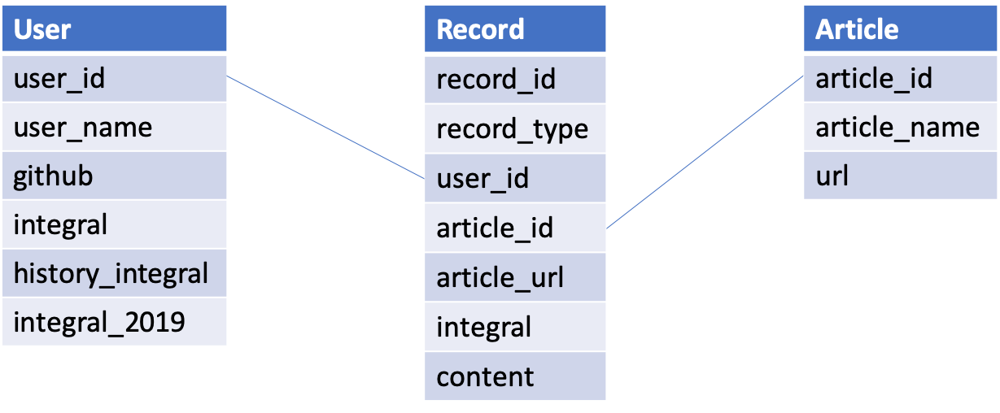

# juejin-integral-database

简单的 KV 数据库，以实现 markdown 积分表的快速管理及数据统计

### Schema

### Feature List

- [x] 解析 `integrals.md` 并构建 KV 数据库
- [ ] 校验历史积分
- [x] 增加作者功能
- [x] 增加积分奖励功能
- [x] 增加文章功能
- [ ] 增加积分兑换功能
- [x] 增加统计功能
- [x] 将数据库导出为 `integrals.md` 文件
- [ ] 外部 API，用于后续模型